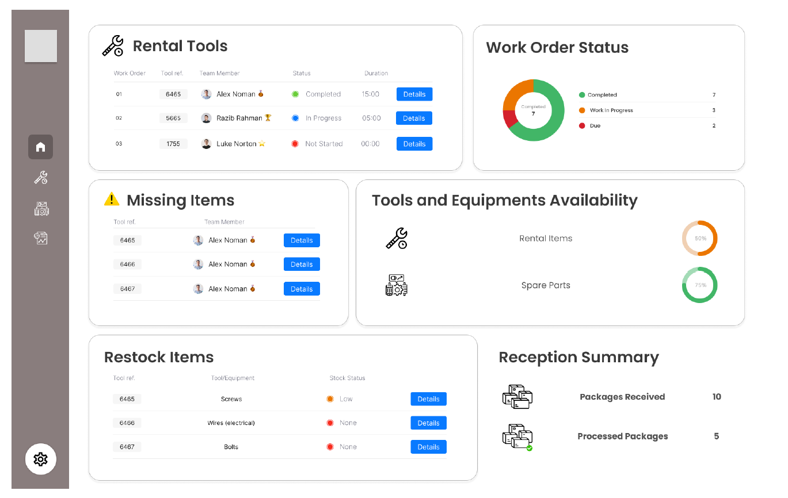

# [](https://githiomi.github.io/HGHF) TOOLS AND EQUIPMENT MANAGEMENT DASHBOARD

> Developed by <a href="http://github.com/githiomi">DANIEL GITHIOMI</a>

## DESCRIPTION

This is a [Next.js](https://nextjs.org/) project bootstrapped with [`create-next-app`](https://github.com/vercel/next.js/tree/canary/packages/create-next-app).

This is the Full-Stack Test given by Dakri Cartons for the Full Stack Developer Position. The task is to create a dashboard using React or NextJS with Typescript preferably.

## WEBSITE DESIGN REQUIREMENT

The Figma design below shows the expected output of the NextJs project



## PREVIEW

Following the design requirements, the output of this project looks as follows:


## DEVELOPMENT STACK

* Programming language: __Typescript__
* Framework: __NextJs__

## COMPATIBILITY

Compatible with all browsers including Safari and Internet Explorer making sure it is responsive.

## LOW LEVEL TECHNOLOGIES USED

This portfolio was made entirely using Visual Studio Code using the following technologies:

* HTML 5
* CSS
* TailwindCSS
* TypeScript

## KNOWN BUGS

No bugs to report at the moment! the system works efficiently at 100% guaranteed.

__Slow internet connection can result in faulty rendering of animations and images__

## LIVE PAGES

This repository has __NO__ active live pages

## SETUP INSTRUCTIONS

* Make sure to have __NodeJS__ runtime installed on the system
  * If not installed, [download here](https://nodejs.org/en/download)

* Git clone [this](https://www.github.com/githiomi/Test-Dashboard) into your terminal.  
* Enter into the project directory using the __cd 'Test-Dashboard'__ command
* Open a terminal that is open in the current working directory
* Run the following command to install all required node packages

``` (JavaScript)
npm install *or* npm i
```

* Run the command below to run the application in development mode

``` (Javasript)
npm run dev
```

* To run the production ready version of the application, use the following command

``` (Javasript)
npm run start
```

## VERCEL DEPLOYMENT

* __NO__ live deployment has been done yet. This is a pending feature

The easiest way to deploy your Next.js app is to use the [Vercel Platform](https://vercel.com/new?utm_medium=default-template&filter=next.js&utm_source=create-next-app&utm_campaign=create-next-app-readme) from the creators of Next.js.

Check out our [Next.js deployment documentation](https://nextjs.org/docs/deployment) for more details.

## SUPPORT AND CONTACT INFORMATION

Contact me through any of the following channels:

* Slack: danielgithiomi
* Email: [danielgithiomi](danielgithiomi@gmail.com)

## LICENSES

Click the following to access my license page: [Click-Here](https://githiomi.github.io/Privacy-Policy/)

> Copyright (c) {2024} Daniel Githiomi.
